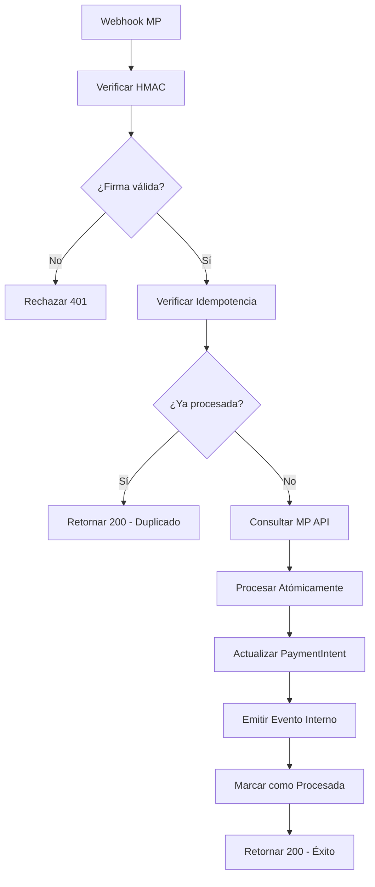

# Mejoras del Sistema de Pagos - Webhook de Mercado Pago

## Resumen de Mejoras Implementadas

Este documento describe las mejoras críticas implementadas en el sistema de pagos de AlojaSys, específicamente en el manejo de webhooks de Mercado Pago.

## 🔒 1. Verificación HMAC de Webhooks

### Problema
Los webhooks de Mercado Pago no tenían verificación de autenticidad, lo que representaba una vulnerabilidad de seguridad.

### Solución
Implementación de verificación HMAC usando el `webhook_secret` configurado en `PaymentGatewayConfig`.

```python
# Verificación de firma HMAC
def verify_webhook_signature(request, webhook_secret):
    signature = request.headers.get('X-Signature')
    expected_signature = hmac.new(
        webhook_secret.encode('utf-8'),
        request.body,
        hashlib.sha256
    ).hexdigest()
    return hmac.compare_digest(signature, expected_signature)
```

### Archivos Modificados
- `backend/apps/payments/services/webhook_security.py` - Servicio de seguridad
- `backend/apps/payments/views.py` - Webhook handler actualizado

## 🔄 2. Idempotencia con Redis

### Problema
Los webhooks duplicados podían procesar el mismo pago múltiples veces, causando inconsistencias.

### Solución
Sistema de idempotencia usando Redis para rastrear notificaciones ya procesadas.

```python
# Verificar si ya fue procesada
def is_notification_processed(notification_id, external_reference):
    cache_key = f"mp_notification:{notification_id}"
    return cache.get(cache_key) is not None

# Marcar como procesada
def mark_notification_processed(notification_id, external_reference, ttl=86400):
    cache.set(cache_key, processed_data, ttl)
```

### Archivos Modificados
- `backend/apps/payments/services/webhook_security.py` - Funciones de idempotencia
- `backend/apps/payments/views.py` - Verificación en webhook handler

## ⚛️ 3. Actualizaciones Atómicas

### Problema
Las actualizaciones de `PaymentIntent.status` no eran atómicas, causando condiciones de carrera.

### Solución
Uso de transacciones atómicas con `select_for_update()` para evitar condiciones de carrera.

```python
@transaction.atomic
def update_payment_status(payment_intent, new_status, **kwargs):
    payment_intent = PaymentIntent.objects.select_for_update().get(
        id=payment_intent.id
    )
    payment_intent.status = new_status
    payment_intent.save()
```

### Archivos Modificados
- `backend/apps/payments/services/payment_processor.py` - Servicio de procesamiento atómico

## 📡 4. Sistema de Eventos Internos

### Problema
No había notificaciones internas cuando cambiaba el estado de los pagos.

### Solución
Implementación de señales Django para eventos de pago.

```python
# Señales disponibles
payment_approved = Signal()
payment_rejected = Signal()
payment_created = Signal()
payment_updated = Signal()

# Emitir evento
emit_payment_event('payment:approved', payment_intent, **data)
```

### Archivos Modificados
- `backend/apps/payments/signals.py` - Sistema de señales
- `backend/apps/payments/services/payment_processor.py` - Emisión de eventos

## 🧪 5. Tests Comprehensivos

### Problema
Faltaban tests para simular duplicados y latencia en el adapter de Mercado Pago.

### Solución
Suite completa de tests que incluye:
- Verificación HMAC
- Detección de duplicados
- Simulación de latencia
- Actualizaciones atómicas
- Eventos internos

```python
# Test de duplicados
def test_webhook_duplicate_detection(self):
    # Marcar como procesada
    WebhookSecurityService.mark_notification_processed("notif_123")
    
    # Enviar webhook duplicado
    response = self.client.post(webhook_url, data)
    self.assertEqual(response.status_code, 200)
    self.assertIn("ya procesada", response.json()['note'])
```

### Archivos Creados
- `backend/test_webhook_improvements.py` - Tests comprehensivos
- `backend/test_webhook_manual.py` - Script de prueba manual

## 🏗️ Arquitectura de la Solución

### Servicios Creados

1. **WebhookSecurityService**
   - Verificación HMAC
   - Manejo de idempotencia
   - Extracción segura de datos
   - Logging de eventos de seguridad

2. **PaymentProcessorService**
   - Actualizaciones atómicas
   - Procesamiento de webhooks
   - Emisión de eventos internos
   - Manejo de errores robusto

3. **Sistema de Señales**
   - Eventos de pago aprobado/rechazado
   - Handlers configurables
   - Logging estructurado

### Flujo de Procesamiento Mejorado



## 🔧 Configuración Requerida

### Variables de Entorno
```bash
# Requeridas
MP_ACCESS_TOKEN=your_access_token
MP_PUBLIC_KEY=your_public_key

# Opcionales (fallback si no está en PaymentGatewayConfig)
MP_WEBHOOK_SECRET=your_webhook_secret
```

### Configuración de Redis
```python
# settings.py
CACHES = {
    'default': {
        'BACKEND': 'django.core.cache.backends.redis.RedisCache',
        'LOCATION': 'redis://127.0.0.1:6379/1',
    }
}
```

### Configuración de PaymentGatewayConfig
```python
# Ejemplo de configuración por hotel
PaymentGatewayConfig.objects.create(
    provider="mercado_pago",
    hotel=hotel,
    public_key="APP_USR_...",
    access_token="APP_USR_...",
    webhook_secret="your_webhook_secret",
    is_test=True
)
```

## 🚀 Cómo Usar

### 1. Ejecutar Tests
```bash
# Tests unitarios
python manage.py test test_webhook_improvements

# Test manual
python test_webhook_manual.py
```

### 2. Configurar Webhook en Mercado Pago
1. Ir a la configuración de webhooks en Mercado Pago
2. Configurar URL: `https://tu-dominio.com/api/payments/webhook/`
3. Configurar eventos: `payment`
4. Copiar el webhook secret a `PaymentGatewayConfig`

### 3. Monitorear Eventos
Los eventos se registran en los logs de Django. Para monitoreo avanzado, configurar handlers personalizados:

```python
from apps.payments.signals import payment_approved

@receiver(payment_approved)
def handle_payment_approved(sender, instance, event_data, **kwargs):
    # Tu lógica personalizada aquí
    send_notification(instance.reservation.guest_email)
```

## 📊 Métricas y Monitoreo

### Logs Estructurados
Todos los eventos se registran con información estructurada:

```json
{
  "event_type": "payment_approved",
  "payment_intent_id": 123,
  "reservation_id": 456,
  "hotel_id": 789,
  "status": "approved",
  "timestamp": "2024-01-01T12:00:00Z"
}
```

### Eventos de Seguridad
- `hmac_verified` - Firma HMAC válida
- `hmac_failed` - Firma HMAC inválida
- `duplicate_detected` - Notificación duplicada
- `payment_processed` - Pago procesado exitosamente

## 🔍 Troubleshooting

### Problemas Comunes

1. **Error 401 - Firma HMAC inválida**
   - Verificar que `webhook_secret` esté configurado correctamente
   - Verificar que Mercado Pago esté enviando la firma en header `X-Signature`

2. **Pagos duplicados**
   - Verificar que Redis esté funcionando
   - Verificar configuración de TTL en cache

3. **Eventos no se emiten**
   - Verificar que los handlers estén registrados
   - Verificar logs de Django para errores

### Debug Mode
Para debugging, configurar en `settings.py`:

```python
LOGGING = {
    'loggers': {
        'apps.payments': {
            'level': 'DEBUG',
            'handlers': ['console'],
        }
    }
}
```

## 🎯 Próximos Pasos

1. **Implementar Circuit Breaker** - Para manejo robusto de fallos de API
2. **Métricas con Prometheus** - Para monitoreo avanzado
3. **Health Checks** - Para verificar estado del sistema
4. **Rate Limiting** - Para prevenir abuso de webhooks
5. **Implementación Real del Adapter** - Completar integración con MP API

## 📝 Notas de Desarrollo

- Todos los cambios son backward compatible
- Los tests cubren casos edge y escenarios de fallo
- El sistema es resiliente a fallos de Redis (fallback a DB)
- Los eventos son asíncronos y no bloquean el procesamiento principal
