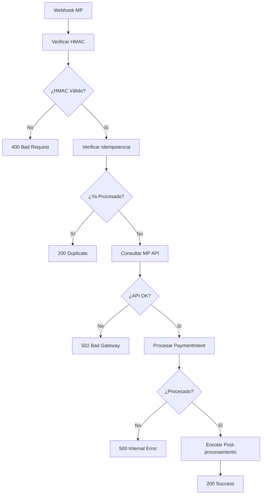

# 🔔 Mejoras del Sistema de Webhooks - AlojaSys

## 📋 Resumen de Mejoras Implementadas

Se han implementado mejoras significativas en el sistema de webhooks de AlojaSys para cumplir con los requisitos de seguridad, idempotencia y post-procesamiento.

## ✅ Funcionalidades Implementadas

### 1. **Verificación HMAC Mejorada**
- ✅ Verificación de firma HMAC usando `webhook_secret`
- ✅ Respuestas HTTP claras (400 para fallos de verificación)
- ✅ Logging de eventos de seguridad
- ✅ Fallback a variable de entorno si no hay configuración

### 2. **Sistema de Idempotencia Robusto**
- ✅ Verificación de notificaciones duplicadas
- ✅ Cache Redis para tracking de notificaciones
- ✅ Respuestas HTTP consistentes para duplicados
- ✅ Logging de eventos de idempotencia

### 3. **Actualización Atómica de PaymentIntent**
- ✅ Transacciones atómicas para actualizaciones
- ✅ Manejo de estados de pago
- ✅ Creación automática de PaymentIntent si no existe
- ✅ Logging de cambios de estado

### 4. **Post-procesamiento Asíncrono con Celery**
- ✅ Tarea `process_webhook_post_processing` para notificaciones
- ✅ Tarea `process_webhook_post_processing` para auditoría
- ✅ Encolado automático después del procesamiento exitoso
- ✅ Manejo de errores con reintentos automáticos

### 5. **Respuestas HTTP Estandarizadas**
- ✅ Estructura consistente de respuestas
- ✅ Códigos de error específicos
- ✅ Información detallada de procesamiento
- ✅ Indicadores de post-procesamiento

## 🏗️ Arquitectura del Sistema

### **Flujo de Procesamiento de Webhooks**



### **Componentes Principales**

1. **`WebhookSecurityService`**: Verificación HMAC e idempotencia
2. **`PaymentProcessorService`**: Procesamiento atómico de pagos
3. **`process_webhook_post_processing`**: Tarea de Celery para post-procesamiento
4. **Endpoint `/api/payments/webhook/`**: Endpoint principal mejorado

## 📝 Uso del Sistema

### **Endpoint Webhook**

```http
POST /api/payments/webhook/
Content-Type: application/json
X-Signature: <hmac_signature>

{
  "data": {
    "id": "123456789",
    "status": "approved",
    "external_reference": "reservation:1|hotel:1",
    "transaction_amount": 200.00
  },
  "type": "payment",
  "id": "123456789",
  "notification_id": "notification_123",
  "external_reference": "reservation:1|hotel:1"
}
```

### **Respuestas del Endpoint**

#### **✅ Procesamiento Exitoso**
```json
{
  "success": true,
  "processed": true,
  "payment_intent_id": 123,
  "status": "approved",
  "message": "Pago procesado exitosamente",
  "post_processing_queued": true
}
```

#### **❌ Error de Verificación HMAC**
```json
{
  "success": false,
  "error": "Firma HMAC inválida",
  "code": "HMAC_VERIFICATION_FAILED"
}
```

#### **⚠️ Notificación Duplicada**
```json
{
  "success": true,
  "processed": false,
  "message": "Notificación ya procesada",
  "code": "DUPLICATE_NOTIFICATION"
}
```

## 🔧 Configuración

### **Variables de Entorno**

```bash
# Token de acceso de Mercado Pago
MP_ACCESS_TOKEN=your_access_token

# Secreto del webhook (fallback)
MP_WEBHOOK_SECRET=your_webhook_secret
```

### **Configuración de PaymentGatewayConfig**

```python
gateway_config = PaymentGatewayConfig.objects.create(
    provider='mercado_pago',
    enterprise=enterprise,
    hotel=hotel,
    public_key='TEST_PUBLIC_KEY',
    access_token='TEST_ACCESS_TOKEN',
    webhook_secret='test_webhook_secret',  # Para verificación HMAC
    is_test=True,
    is_active=True
)
```

## 🧪 Testing

### **Ejecutar Tests**

```bash
# Ejecutar tests de webhook
python manage.py test test_webhook_improvements -v 2

# Ejecutar tests específicos
python manage.py test test_webhook_improvements.WebhookImprovementsTestCase.test_webhook_hmac_verification_success -v 2
```

### **Tests Incluidos**

- ✅ Verificación HMAC exitosa
- ✅ Fallo en verificación HMAC
- ✅ Detección de notificaciones duplicadas
- ✅ Error por ACCESS_TOKEN faltante
- ✅ Error en API de Mercado Pago
- ✅ Encolado de post-procesamiento
- ✅ Eventos inválidos
- ✅ Webhooks sin payment_id

## 📊 Monitoreo y Logging

### **Eventos de Seguridad**

```python
# Verificación HMAC exitosa
WebhookSecurityService.log_webhook_security_event(
    'hmac_verified',
    notification_id=notification_id,
    external_reference=external_reference,
    details={'payment_id': payment_id}
)

# Fallo en verificación HMAC
WebhookSecurityService.log_webhook_security_event(
    'hmac_failed',
    notification_id=notification_id,
    external_reference=external_reference,
    details={'payment_id': payment_id}
)

# Notificación duplicada
WebhookSecurityService.log_webhook_security_event(
    'duplicate_detected',
    notification_id=notification_id,
    external_reference=external_reference,
    details={'payment_id': payment_id}
)
```

### **Auditoría de Webhooks**

```python
# Log de auditoría automático
logger.info(
    f"Webhook audit: PaymentIntent {payment_intent.id} - Status: {payment_intent.status}",
    extra={
        'payment_intent_id': payment_intent.id,
        'reservation_id': payment_intent.reservation.id,
        'hotel_id': payment_intent.hotel.id,
        'webhook_status': payment_intent.status,
        'mp_payment_id': webhook_data.get('id'),
        'notification_id': notification_id,
        'external_reference': external_reference,
        'amount': float(payment_intent.amount),
        'currency': payment_intent.currency,
        'processed_at': timezone.now().isoformat(),
        'webhook_data': webhook_data
    }
)
```

## 🚀 Post-procesamiento Asíncrono

### **Tarea de Celery**

```python
from apps.payments.tasks import process_webhook_post_processing

# Encolar tarea de post-procesamiento
process_webhook_post_processing.delay(
    payment_intent_id=123,
    webhook_data=payment_data,
    notification_id='notification_123',
    external_reference='reservation:1|hotel:1'
)
```

### **Funcionalidades de Post-procesamiento**

1. **Notificaciones Automáticas**:
   - Pago aprobado
   - Pago rechazado
   - Pago pendiente
   - Webhook procesado

2. **Auditoría Completa**:
   - Log estructurado
   - Metadatos del webhook
   - Información de la reserva
   - Timestamps

3. **Eventos Internos**:
   - Actualización de inventario
   - Generación de comprobantes
   - Envío de emails
   - Integraciones externas

## 🔒 Seguridad

### **Verificación HMAC**

```python
def verify_webhook_signature(request, webhook_secret: str) -> bool:
    """
    Verifica la firma HMAC del webhook de Mercado Pago
    """
    signature = request.headers.get('X-Signature')
    body = request.body
    
    expected_signature = hmac.new(
        webhook_secret.encode('utf-8'),
        body,
        hashlib.sha256
    ).hexdigest()
    
    return hmac.compare_digest(signature, expected_signature)
```

### **Idempotencia**

```python
def is_notification_processed(notification_id: str, external_reference: str = None) -> bool:
    """
    Verifica si una notificación ya fue procesada
    """
    cache_key = f"mp_notification:{notification_id}"
    return cache.get(cache_key) is not None
```

## 📈 Beneficios de las Mejoras

### **Seguridad**
- ✅ Verificación HMAC robusta
- ✅ Prevención de ataques de replay
- ✅ Logging de eventos de seguridad
- ✅ Validación de datos

### **Confiabilidad**
- ✅ Idempotencia garantizada
- ✅ Procesamiento atómico
- ✅ Manejo de errores robusto
- ✅ Reintentos automáticos

### **Observabilidad**
- ✅ Logging estructurado
- ✅ Auditoría completa
- ✅ Monitoreo de eventos
- ✅ Trazabilidad de webhooks

### **Escalabilidad**
- ✅ Post-procesamiento asíncrono
- ✅ Encolado de tareas
- ✅ Procesamiento distribuido
- ✅ Manejo de alta concurrencia

## 🎯 Próximos Pasos

### **Mejoras Futuras**
1. **Métricas Avanzadas**: Dashboard de monitoreo de webhooks
2. **Alertas**: Notificaciones de fallos críticos
3. **Rate Limiting**: Protección contra spam
4. **Webhook Replay**: Reprocesamiento de webhooks fallidos
5. **Integración Externa**: APIs de terceros para auditoría

### **Optimizaciones**
1. **Cache Inteligente**: Cache de configuraciones de gateway
2. **Batch Processing**: Procesamiento por lotes
3. **Compresión**: Compresión de logs de auditoría
4. **Archivado**: Archivado automático de logs antiguos

---

## 📞 Soporte

Para consultas o problemas con el sistema de webhooks, contactar al equipo de desarrollo de AlojaSys.

**Versión**: 1.0.0  
**Fecha**: Enero 2024  
**Autor**: Equipo AlojaSys

